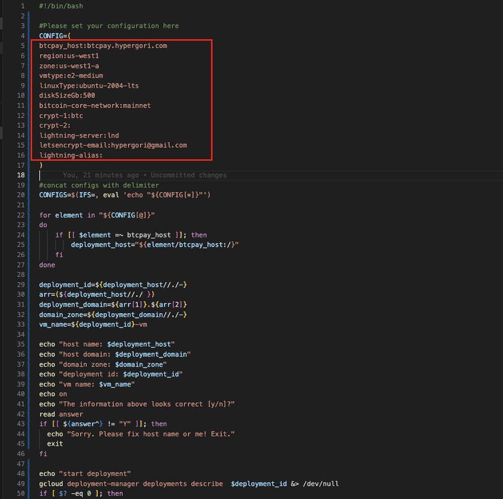
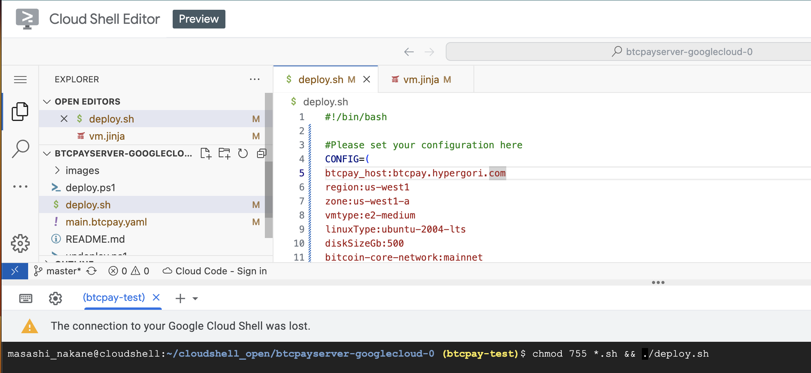

# BTCPayServer on Google Cloud

Instructions to deploy BTCPay Server in [production environment](https://github.com/btcpayserver/btcpayserver-docker/tree/master/Production) hosted in Google Cloud.

The following instructions assume 
1. You already get a domain name from Google Cloud Domain e.g. hypergori.com
2. You decided the hostname with the domain name  e.g. btcpay.hypergori.com

[](https://console.cloud.google.com/cloudshell/open?git_repo=https%3A%2F%2Fgithub.com%2Fbtcpayserver%2Fbtcpayserver-googlecloud&page=editor)

You can see our video for an overview:  
[](https://youtu.be/ltKUzFaer2g "BTCPay - Google cloud shell Setup")

You can find more details about the tooling install in the Virtual Machine in [the tooling section of BTCPayServer-Docker repository](https://github.com/btcpayserver/btcpayserver-docker/blob/master/README.md#tooling).

## Overview
To install BTCPay server with this google  cloud deployment template. Here is the steps
   
1. Click `Google Cloud Shell` the link above
2. Create Google cloud project if you haven't and set default project 
3. Set the server host name of your to-be-BCTPAY server in deploy.sh
4. Run deploy script
5. Test to access https://\<your host name> and sign up to sign up the admin user

## Setup gcloud tool
There are two ways to deploy from this document.
1. deploy from Google Cloud shell
2. deploy from your local computer

This document focuses only on #1 for brievity.

In case that you run the deploy script from local computer, you need to install gcloud sdk tool. https://cloud.google.com/sdk/docs/, clone this github repo and follow the same steps basically.

If you prefer the Google cloud shell, you dont need to install anything. It's already in the cloud shell environment. Just click the link above. 

Let's get started !

First, we need google cloud project if you haven't created. I assume you haven't. 
Let's say the project name is 'btcpay-test'

```
$ cd btcpayserver-googlecloud
$ gcloud projects create btcpay-test --set-as-default
```

If you already have a project, set it as a default
```
$ gcloud config set project btcpay-test
```


## Modify parameters in the main.btcpay.yaml
You can customize your BTCPay server install parameters by modifying the file.
The default configuration is,

* hostname :  btcpay.hypergori.com
* region : us-west1
* zone : us-west1-a
* vm instance type : e2-medium (1 vCPU with 4G Memory)
* linux : ubuntu 20.04 LTS
* boot disksize : 500GB
* bitcoin network: mainnet
* lightning implementation: lnd
* prune mode with 1 year data



### Parameters
Mandatory fields in the red rectangle above are required and you have to decide what to set.
Optional parameters are not required and normally just keep it empty.
Customze parameters are for experts only and change only when you know what you are doing.

| type   | parameter name | description | example value|
| ------------- | ------------- |------------- | ------------- | 
| Mandatory| region  | Region to deploy  | asia-northeast1|
| Mandatory| zone | Zone to deploy | asia-northeast1-b |
| Mandatory| vmtype | [vm type](https://cloud.google.com/compute/docs/machine-types)  | e2-medium |
| Mandatory| diskSizeGb | root disk size in GB | 500 |
| Mandatory| BTCPAY_HOST  | host name of the btcpay server | btcpaytest.mycompany.net|
| Mandatory| NBITCOIN_NETWORK | [network type](https://github.com/btcpayserver/btcpayserver-docker/tree/master/Production) | mainnet |
| Mandatory| BTCPAYGEN_CRYPTO1 | crypto currecy | btc |
| Mandatory| BTCPAYGEN_LIGHTNING | lightning implementation type (lnd or c-lightning) | lnd |
| Optional| LETSENCRYPT_EMAIL | email notified by  let's encrypt free SSL | |
| Optional| LIGHTNING_ALIAS | lightning node's alias | |
| Optional| BTCPAYGEN_CRYPTO2 | other crypto currency, ltc ,btg | |
| Customize| BTCPAYGEN_ADDITIONAL_FRAGMENTS | [bitcoind prune config](https://github.com/btcpayserver/btcpayserver-docker/blob/master/README.md#generated-docker-compose-) | opt-save-storage |
| Customize| BTCPAY_DOCKER_REPO | btcpay github repo |https://github.com/btcpayserver/btcpayserver-docker |
| Customize| BTCPAY_DOCKER_REPO_BRANCH | btcpay github repo branch |master |
| Customize| BTCPAYGEN_REVERSEPROXY | reverse proxy |nginx |
| Customize| ACME_CA_URI | let's encrpt url |https://acme-staging.api.letsencrypt.org/directory |

## let's undetstand what the Deployment script does
1. It creates the VM instance as you configured in the yaml, that is CPU, Memory, Disk size. 
2. create hostname of your domain zone in Google DNS
3. It creates 1 public static IP and attached to the hostname
4. On the VM side, install BTCPay server as root using docker compose from BTCPay Github repo
5. setup SSL certificate for free! with let's encrypt.

It would cost USD 45 with above default vm machine, excluding Domain name cost and DNS (12 bucks?).
You can adjust the vm machine spec by changing vmtype. 

## Deploy VM instance
Once you configure the configuration in deployment.sh You are ready to deploy it to GCP.
Do "chmod" to the shell scripts and run it.
```
chmod 755 *.sh && ./deploy
```
Around 3+ minutes later, it will say "vm was deployed. Access the url."
But it may take a few more minuts because docker compose download many of docker images of BTCPay components.
Also, it talks to Let's encrypt and have it verify the host name is legitimit and issue SSL certification and install.





## UnDeploy
With bash, pass the host name. 
```
./undeploy.sh btcpay.hypergori.com
```

## DNS Mapping and generate ssl certificate

This will be done automatically by the deployment script.


Test the install by accessing https://\<your host name\> and signup the first user who becomes the powerful admin user. So, Don't let the server runing without creating the user.
You will see the BTCPay top page like this. 


