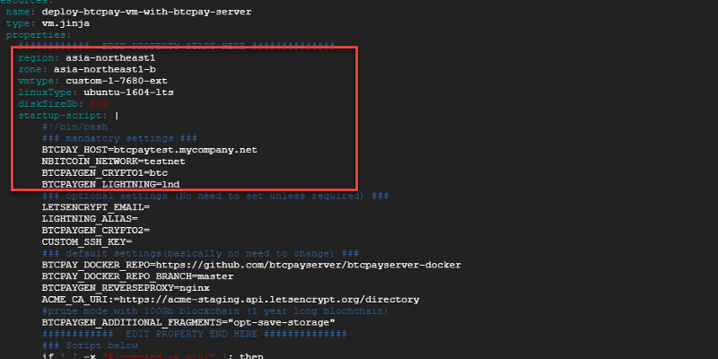
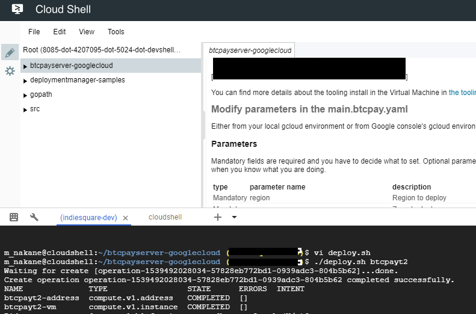
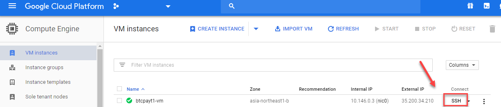
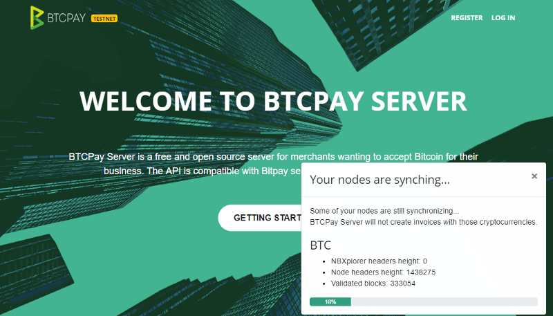

# BTCPayServer Google Cloud

Instructions to deploy BTCPay Server in [production environment](https://github.com/btcpayserver/btcpayserver-docker/tree/master/Production) hosted in Google Cloud.

The following instructions assume you have [Google Cloud](https://console.cloud.google.com) subscription.

[](https://console.cloud.google.com/cloudshell/open?git_repo=https%3A%2F%2Fgithub.com%2Fbtcpayserver%2Fbtcpayserver-googlecloud&page=editor)

You can see our video for an overview:  
[](https://youtu.be/LXwEuvHK9Aw "BTCPay - Google cloud shell Setup")

You can find more details about the tooling install in the Virtual Machine in [the tooling section of BTCPayServer-Docker repository](https://github.com/btcpayserver/btcpayserver-docker/blob/master/README.md#tooling).

## Overview
To install BTCPay server with this google  cloud deployment template  
1. Start Google cloud shell with the link above (or Install gcloud sdk local computer)
2. set the default project and zone to gcloud env where the BTCPay instance belongs
3. Modify the instance and BTCPay's parameters in yaml file
4. run deploy script and it shows static IP assgined for later use, DNS
5. Do DNS setup with your Domain name provider (Google DNS, GOdaddy etc.)  
6. ssh into the vm instance and run changedomain.sh to setup free ssl certificate
7. test to access https://\<yourdomain\> and sign up (1st registered user becomes the admin user)  

## Setup gcloud tool
In case that you run the deploy script from local computer, you need to install gcloud sdk tool. https://cloud.google.com/sdk/docs/
If you prefer the Google cloud shell, you dont need to install anything and what is better? You dont need update the sdk. It's already in the cloud .Just click the link above in this document. This document is written for google cloud shell, but it should be very similar to local gcloud sdk.

Now, assuming that you have a google cloud shell running on your browser, you would notice this repo is automatically cloned and change-directory-ed to the folder. How cool ! Let's set up the default project and default zone.

```
hypergori@cloudshell:~/btcpayserver-googlecloud$ gcloud config set project testproject
Updated property [core/project].
hypergori@cloudshell:~/btcpayserver-googlecloud (testproject)$ gcloud config set compute/zone asia-northeast1-b
Updated property [compute/zone].
```

## Modify parameters in the main.btcpay.yaml
Either from your local gcloud environment or from Google console's gcloud environment, you can customize your BTCPay server install parameters by modifying in the file.THe detail is the table below.
The default config is,  

* region is asia-northeast1
* zone is asia-northeast1-b
* 1 vCPU with 7.6G Memory 
* boot disksize : 500GB
* bitcoin testnet
* use lnd
* temporary Hostname is btcpaytest.mycompany.net (will change it later)
* prune mode with 1 year data



### Parameters
Mandatory fields in the red rectangle above are required and you have to decide what to set.
Optional parameters are not required and normally just keep it empty.
Customze parameters are for experts only and change only when you know what you are doing.

| type   | parameter name | description | example value|
| ------------- | ------------- |------------- | ------------- | 
| Mandatory| region  | Region to deploy  | asia-northeast1|
| Mandatory| zone | Zone to deploy | asia-northeast1-b |
| Mandatory| vmtype | [vm type,f1-micro etc or custom-numOfCpu-memInMeg-ext](https://cloud.google.com/compute/docs/machine-types)  | custom-1-7680-ext |
| Mandatory| diskSizeGb | root disk size in GB | 500 |
| Mandatory| BTCPAY_HOST  | host name of the btcpay server | btcpaytest.mycompany.net|
| Mandatory| NBITCOIN_NETWORK | [network type](https://github.com/btcpayserver/btcpayserver-docker/tree/master/Production) | testnet |
| Mandatory| BTCPAYGEN_CRYPTO1 | crypto currecy | btc |
| Mandatory| BTCPAYGEN_LIGHTNING | lightning implementation type (lnd or c-lightning) | lnd |
| Optional| LETSENCRYPT_EMAIL | email notified by  let's encrypt free SSL | |
| Optional| LIGHTNING_ALIAS | lightning node's alias | |
| Optional| BTCPAYGEN_CRYPTO2 | other crypto currency, ltc ,btg | |
| Optional| CUSTOM_SSH_KEY | ssh public key   |  |  |
| Customize| BTCPAYGEN_ADDITIONAL_FRAGMENTS | [bitcoind prune config](https://github.com/btcpayserver/btcpayserver-docker/blob/master/README.md#generated-docker-compose-) | opt-save-storage |
| Customize| BTCPAY_DOCKER_REPO | btcpay github repo |https://github.com/btcpayserver/btcpayserver-docker |
| Customize| BTCPAY_DOCKER_REPO_BRANCH | btcpay github repo branch |master |
| Customize| BTCPAYGEN_REVERSEPROXY | reverse proxy |nginx |
| Customize| ACME_CA_URI | let's encrpt url |https://acme-staging.api.letsencrypt.org/directory |

## What the Deployment script does
It would cost USD 70 with above default config,and you can adjust the config in yaml.  
What dose this deployment script do ? 
1. It creates the VM instance as you configured in the yaml, that is CPU, Memory, Disk size. It runs gcloud command under the hood.
2. It creates 1 public static IP and attach it to the instance
3. Install BTCPay server on the root directory as root using docker compose from BTCPay Github repo

## What the Deployment script does not do
1. DNS ip mapping should be done manually by yourself at any DNS service of your choice
2. Also, ssl certificate generation should be done via ssh from Google cloud console

## Deploy

Once you configure the yaml file. You are ready to deploy it to GCP.
Do "chmod" to the shell scripts and run it.
```
chmod 755 *.sh
./deploy btcpaytest1
```
Around 1 minute later, it outputs the static IP address when it succeeded. If you failed or made mistake on config. you can easily cleanup by undeploy.sh .  
 The name passed after the deploy shell script can be anything and it becomes the name of the deployment, vm instance name in GCE with suffix "-vm" and network name with suffix "-network"

With bash,
```
./deploy.sh btcpaytest1
```
With Powershell
```ps
./deploy.ps1 btcpaytest1
```



## UnDeploy
With bash,
```
./undeploy.sh btcpaytest1
```
With Powershell
```ps
./undeploy.ps1 btcpaytest1
```

## DNS Mapping and generate ssl certificate

Then, Go to your DNS service and map the IP with your domain name. 

Now, you want to generate free SSL certificate with Let's encrypt.
It's easy. just ssh to the vm and run 1 command.  
Go to Google Cloud console -> Compute Engine -> VM instances  
You will see the name of the deployment with "-vm" appended in the list of VMs.

Click the ssh button of the vm and then become super user by
```
sudo su -
cd /btcpayserver-docker/
```
change directory to /btcpay , and then run changedomain.sh with the domain name.

```
changedomain.sh your.newdmain.name
```


Test the install by accessing https://\<your host name\> and signup the 1st user.
You will see the BTCPay top page.




