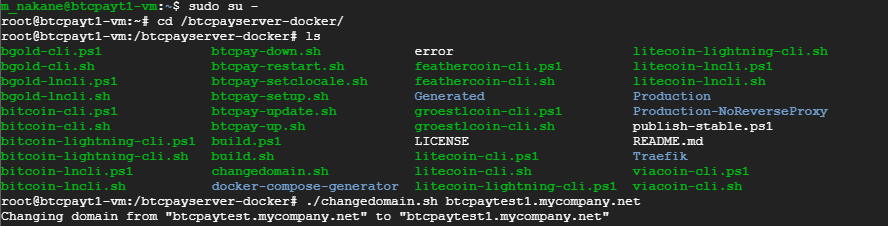

# BTCPayServer Google Cloud

Instructions to deploy BTCPay Server in [production environment](https://github.com/btcpayserver/btcpayserver-docker/tree/master/Production) hosted in Google Cloud.

The following instructions assume you have [Google Cloud](https://console.cloud.google.com) subscription.

[](https://console.cloud.google.com/cloudshell/open?git_repo=https%3A%2F%2Fgithub.com%2Fhypergori%2Fbtcpayserver-googlecloud&page=editor)

You can see our video for an overview: COMMING SOON!

[]  

You can find more details about the tooling install in the Virtual Machine in [the tooling section of BTCPayServer-Docker repository](https://github.com/btcpayserver/btcpayserver-docker/blob/master/README.md#tooling).

## Overview
To install BTCPay server with this google  cloud deployment template
1. Install gcloud sdk locally or use Google cloud shell on console with the link above 
2. set the project to gcloud env, that the BTCPay instance belongs to.
3. Modidy the instance and BTCPay's parameters in yaml file
4. run deploy script and it shows static IP
5. DO DNS setup with your Domain name provider (Google DNS, GOdaddy etc.)
6. ssh into the vm instance and run changedoamin.sh
7. access the https:<yourdomain> and sign up (1st user becomes admin user)

## Modify parameters in the main.btcpay.yaml
Either from your local gcloud environment or from Google console's gcloud environment, you have to customize your BTCPay server install parameters by modifying in the file.

### Parameters
Mandatory fields are required and you have to decide what to set.
Optional parameters are not required and normally just keep it empty.
Customze parameters are for experts only and change only when you know what you are doing.

| type   | parameter name | description | example value|
| ------------- | ------------- |------------- | ------------- | 
| Mandatory| region  | Region to deploy  | asia-northeast1|
| Mandatory| zone | Zone to deploy | asia-northeast1-b |
| Mandatory| vmtype | vm type,f1-micro etc or custom-numOfCpu-memInMeg-ext  | custom-1-7680-ext |
| Mandatory| diskSizeGb | root disk size in GB | 500 |
| Mandatory| BTCPAY_HOST  | host name of the btcpay server | btcpaytest.mycompany.net|
| Mandatory| NBITCOIN_NETWORK | network type | testnet |
| Mandatory| BTCPAYGEN_CRYPTO1 | crypto currecy | btc |
| Mandatory| BTCPAYGEN_LIGHTNING | lightning implementation type (lnd or c-lightning) | lnd |
| Optional| LETSENCRYPT_EMAIL | email notified by  let's encrypt free SSL | |
| Optional| LIGHTNING_ALIAS | lightning node's alias | |
| Optional| BTCPAYGEN_CRYPTO2 | other crypto currency, ltc ,btg | |
| Optional| CUSTOM_SSH_KEY | ssh public key   |  |  |
| Customize| BTCPAYGEN_ADDITIONAL_FRAGMENTS | bitcoind prune config | opt-save-storage |
| Customize| BTCPAY_DOCKER_REPO | btcpay github repo |https://github.com/btcpayserver/btcpayserver-docker |
| Customize| BTCPAY_DOCKER_REPO_BRANCH | btcpay github repo branch |master |
| Customize| BTCPAYGEN_REVERSEPROXY | reverse proxy |nginx |
| Customize| ACME_CA_URI | let's encrpt url |https://acme-staging.api.letsencrypt.org/directory |

## What the Deployment script does
What dose this deployment script do ? 
1. It creates the VM instance as you configured in the yaml, that is CPU, Memory, Disk size.
2. It creates 1 public static IP and attach it to the instance
3. Install BTCPay server on the root directory as root using docker compose from BTCPay Github repo

## What the Deployment script does not do
1. DNS ip mapping should be done manually in any DNS server of your choice
2. then, ssl certificate generation should be done via ssh

## Deploy

Once you configure the yaml file. You are ready to  deploy it to GCP. It outpus the static IP address.
```
./deploy btcpaytest1
```
Then, Go to your DNS service and map the IP with your domainname.
Now, you have to generate free SSL certificate with Let's encrypt.
Go to Google Cloud console -> Compute Engine -> VM instances
you will see the name of the deployment in the list of VMs.
Click the ssh button and then become superuse by.
```
sudo su -
```
change directory to /btcpay , and then run changedomain.sh with the domain name.

```
changedomain.sh btcpaytest1.mycompany.net
```



Test the install by accessing https://<your host name> and signup the 1st user.

## Undeploy

when you undeploy it,
```
./undeploy btcpaytest1
```

